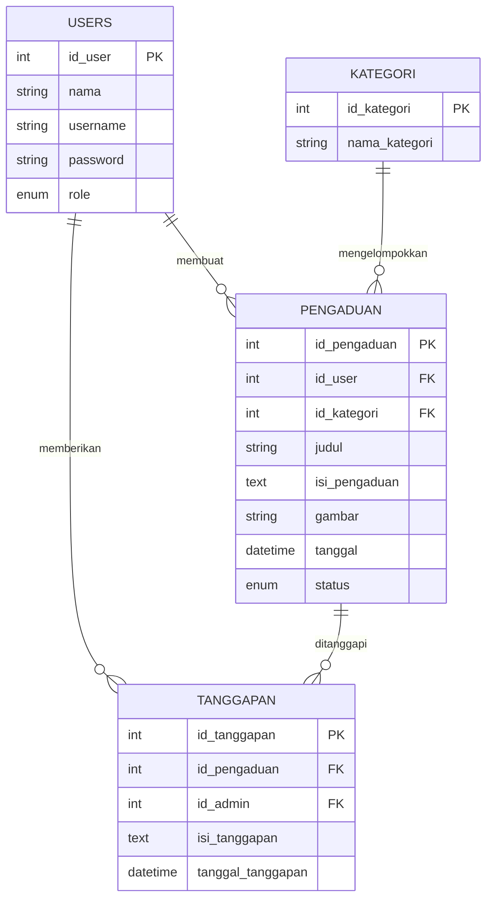

# Dokumentasi ERD - Aplikasi SOPIA
(Sistem Operasi Pengaduan Inventaris & Aset)

Dokumen ini berisi rancangan basis data (ERD) untuk aplikasi pengaduan sarana prasarana sekolah.

## 1. Diagram Relasi (Mermaid)

## 2. Penjelasan Tabel

### a. Tabel `users`
Menyimpan data akun pengguna baik admin maupun siswa.
- **PK**: `id_user`
- **Role**: `admin` (petugas yang memberi tanggapan) dan `siswa` (pelapor).

### b. Tabel `kategori`
Daftar pengelompokan laporan (contoh: Sarana, Kebersihan, Keamanan).
- **PK**: `id_kategori`

### c. Tabel `pengaduan`
Data utama pengaduan yang dikirimkan oleh siswa.
- **PK**: `id_pengaduan`
- **FK**: `id_user` (mengacu pada siapa yang melapor).
- **FK**: `id_kategori` (mengacu pada kategori apa laporan tersebut).

### d. Tabel `tanggapan`
Data balasan atau respon yang diberikan oleh admin terhadap suatu laporan.
- **PK**: `id_tanggapan`
- **FK**: `id_pengaduan` (mengacu pada laporan mana yang ditanggapi).
- **FK**: `id_admin` (mengacu pada admin mana yang memberikan tanggapan).

## 3. Alur Hubungan (Relationship)
1. **Siswa -> Pengaduan (1:N)**: Satu siswa bisa mengirimkan banyak laporan pengaduan.
2. **Kategori -> Pengaduan (1:N)**: Satu kategori bisa digunakan oleh banyak laporan pengaduan.
3. **Pengaduan -> Tanggapan (1:N)**: Satu laporan pengaduan bisa memiliki lebih dari satu tanggapan dari admin (misal diskusi perbaikan).
4. **Admin -> Tanggapan (1:N)**: Satu admin bisa memberikan banyak tanggapan pada berbagai laporan berbeda.
